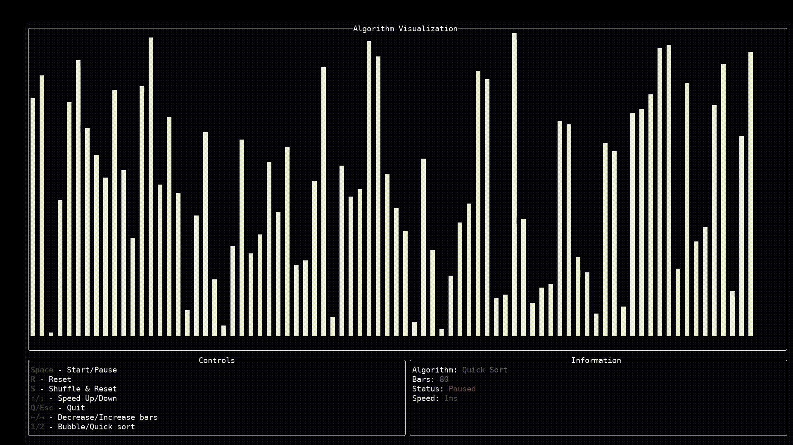

# TUI Algorithm Visualizer

Weekend project written in Rust that visualizes sorting algorithms directly in the terminal. Built using [`crossterm`](https://crates.io/crates/crossterm) and [`ratatui`](https://crates.io/crates/ratatui), currently implements Bubble Sort and Quick Sort. For fun and learning purposes.

## Preview



## Controls

| Key                        | Action                              |
|----------------------------|-------------------------------------|
| `Space`                    | Start / Pause algorithm             |
| `r`                        | Reset current sort (same order)     |
| `s`                        | Shuffle & Reset                     |
| `↑ / ↓`                    | Increase / Decrease speed (ms delay)|
| `← / →`                    | Decrease / Increase number of bars  |
| `1`                        | Use Bubble Sort                     |
| `2`                        | Use Quick Sort                      |
| `q` / `Esc` / `CTRL` + `C` | Quit the application                |

## Clone and Run
```bash
git clone https://github.com/henriqueluhm/tui-algorithm-visualizer.git
cd tui-algorithm-visualizer
cargo run
```

## License
This project is open source and available under the MIT License.