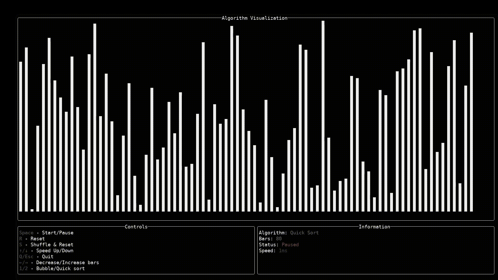

# TUI Algorithm Visualizer

Weekend project written in Rust that visualizes sorting algorithms directly in the terminal. Built with [`crossterm`](https://crates.io/crates/crossterm) and [`ratatui`](https://crates.io/crates/ratatui). Step through Bubble, Quick, Merge, and Selection sort as animated bar charts. Maybe i'll add more sort algorithms and other type of algorithms some day.

## Preview


## Features

- Four sorting algorithms: Bubble, Quick, Merge, and Selection
- Adjustable speed from 1 ms up to `max` (as fast as the terminal allows)
- Resize the terminal to change layout; bar count adapts to available width (10–N bars)
- Highlights active elements (`●`) and comparisons on each step

## Controls

| Key | Action |
|-----|--------|
| `Space` | Start / Pause (when completed: shuffle & reset, then pause) |
| `r` | Reset current sort (same bar order) |
| `s` | Shuffle bars & reset |
| `↑ / ↓` | Faster / slower |
| `← / →` | Fewer / more bars |
| `1` | Bubble Sort |
| `2` | Quick Sort |
| `3` | Merge Sort |
| `4` | Selection Sort |
| `q` / `Esc` / `Ctrl+C` | Quit |

## Clone and Run

```bash
git clone https://github.com/henriqueluhm/tui-algorithm-visualizer.git
cd tui-algorithm-visualizer
cargo run
```

## License

This project is open source and available under the MIT License.
